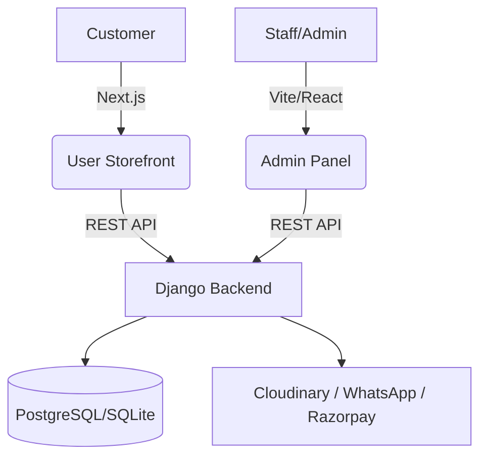

<div align="center">

# 🛋️ CAFCO Home
### Premium Furniture E-commerce Ecosystem

[](https://nextjs.org/)
[](https://react.dev/)
[](https://www.djangoproject.com/)
[](https://tailwindcss.com/)

---

**A modern, scalable, and high-performance e-commerce solution featuring a customer storefront, administrative panel, and powerful REST backend.**

[Explore Storefront](#-storefront-user) • [Admin Dashboard](#-admin-dashboard-admin) • [Backend API](#-backend-api-server) • [Get Started](#-setup--deployment)

</div>

---

## 📂 Project Architecture



---

## 🛒 Storefront (`user/`)
*High-performance furniture shopping experience.*

- ✨ **Smooth UX**: Framer Motion animations & Lenis smooth scrolling.
- 🔐 **NextAuth**: Secure social & email authentication.
- 🎨 **Tailwind CSS**: Fully responsive, custom-designed UI.
- 🔍 **SEO Engine**: Dynamic sitemaps, robots.txt, and metadata.
- 📦 **PWA Ready**: Offline support and home screen installation.

## 🛠 Admin Dashboard (`admin/`)
*Complete control over your business operations.*

- 📊 **Analytics**: Dashboard overview of sales and user activity.
- 📦 **Inventory**: Advanced product & variant management.
- 📋 **Orders**: Real-time order tracking and status updates.
- ✍️ **Content**: Blog and promotional offer management.
- 👥 **Staff**: Granular permissions and staff control.

## ⚡ Backend API (`server/`)
*The engine powering the entire ecosystem.*

- 🔌 **RESTful**: Robust API built with Django Rest Framework.
- 💬 **Messaging**: Automated notifications via WhatsApp Cloud API.
- 💳 **Payments**: Secure processing via Razorpay.
- 🖼 **Assets**: Dynamic media hosting on Cloudinary.

---

## 🚀 Setup & Deployment

<details>
<summary><b>🐍 Backend Server Setup</b></summary>

```bash
cd server
python -m venv venv
# Windows: venv\Scripts\activate | Unix: source venv/bin/activate
pip install -r requirements.txt
python manage.py migrate
python manage.py runserver
```
</details>

<details>
<summary><b>⚛️ User Storefront Setup</b></summary>

```bash
cd user
npm install
npm run dev
```
</details>

<details>
<summary><b>⚡ Admin Dashboard Setup</b></summary>

```bash
cd admin
npm install
npm run dev
```
</details>

---

## 🛡️ Integrated Services

| Service | Purpose |
| :--- | :--- |
| **Razorpay** | Payment Processing |
| **Cloudinary** | Image & Asset Management |
| **WhatsApp API** | Order & Status Notifications |
| **Google Cloud** | OAuth / SSO Authentication |

---

<div align="center">

**Developed with ❤️ for CAFCO Home.**

</div>
